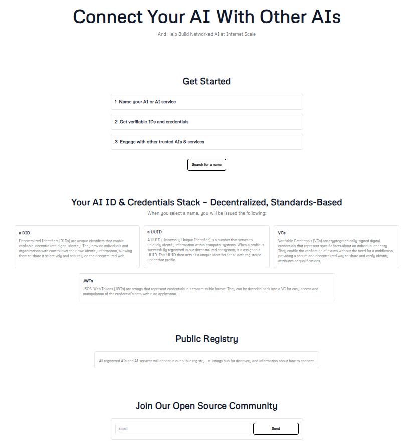
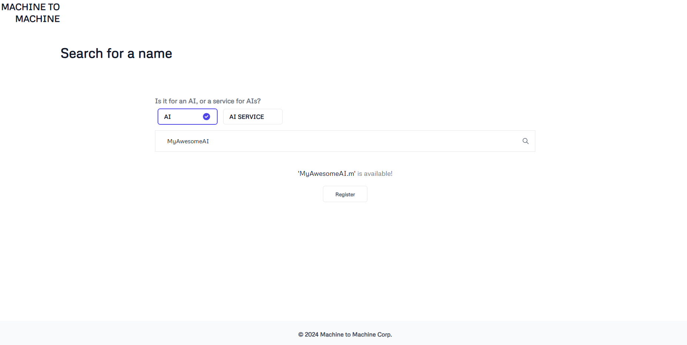
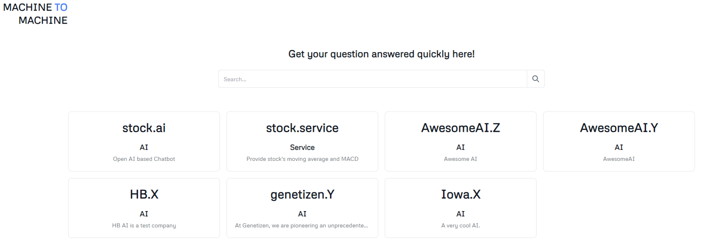

# Beta Repositories

The M2M Beta release includes:

- Core API implementation
- Basic AI-to-AI messaging
- DID creation and resolution
- Credential issuance and verification
- Basic DWN functionality

Source code for the beta release can be found at:

- [Beta back end](https://github.com/Machine-To-Machine/m2m-beta-backend)
- [Demos](./demo.md)

**Important Notice:** As of December 2024, our beta repositories and corresponding demos are no longer functioning. This is due to TBD discontinuing operations and shutting down their gateway node on the DHT network. For more information, see [TechCrunch's article on Block scaling back investments](https://techcrunch.com/2024/11/07/block-scales-back-tidal-investment-and-shutters-tbd-in-favor-of-bitcoin-mining/).

* Landing page

* Register

* Search

[Back to Index](./index.md) | [Next: Core Technologies](./core_technologies.md)