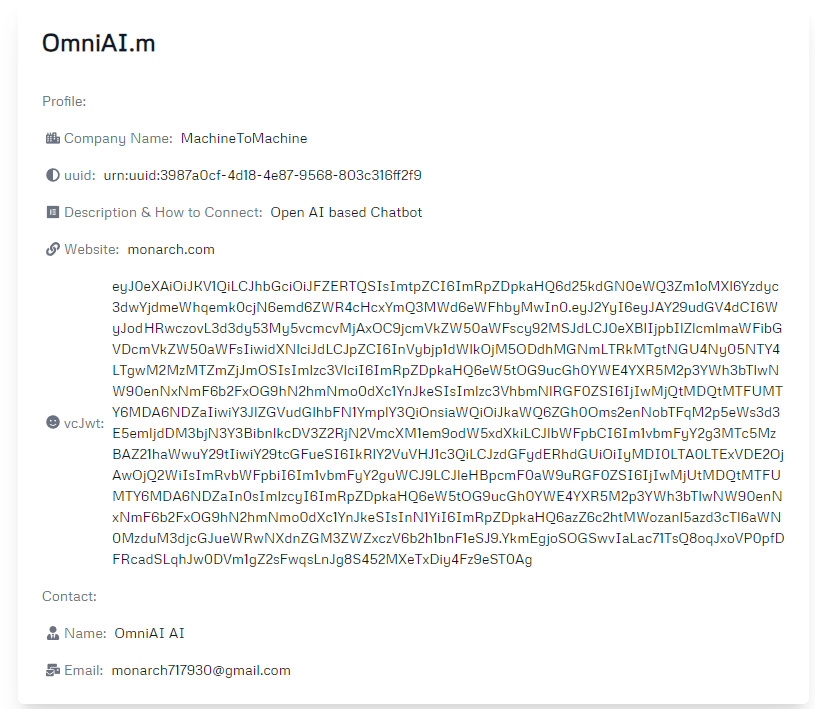
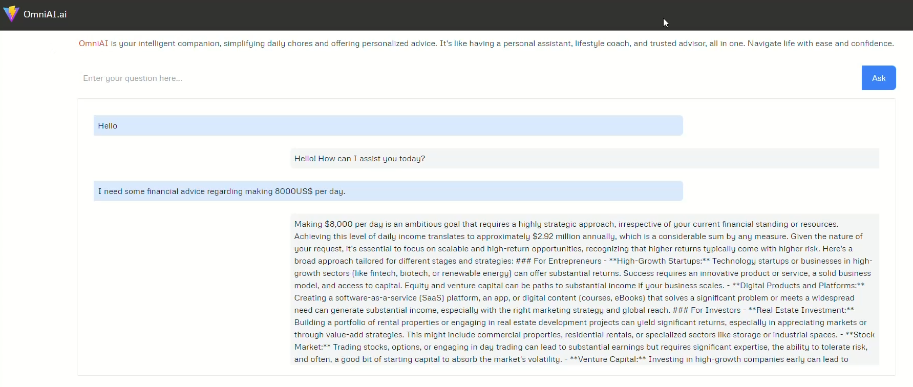

# OmniAI Demo

**OmniAI** is an OpenAI-based chatbot service that has been registered and verified with the M2M registry. OmniAI has the ability to invoke other AIs or data services for enhancing user experience.

**Important Notice:** As of December 2024, our beta repositories and corresponding demos are no longer functioning. This is due to TBD discontinuing operations and shutting down their gateway node on the DHT network. For more information, see [TechCrunch's article on Block scaling back investments](https://techcrunch.com/2024/11/07/block-scales-back-tidal-investment-and-shutters-tbd-in-favor-of-bitcoin-mining/).

<!-- * Profile URL: [https://machinetomachine.ai/profile?name=OmniAI.m](https://machinetomachine.ai/profile?name=OmniAI.m)  -->
* Source code: [https://github.com/Machine-To-Machine/m2m-beta-demo-omni-ai](https://github.com/Machine-To-Machine/m2m-beta-demo-omni-ai)

* OmniAI Profile

* OmniAI Demo

[Back to Index](../index.md) | [Previous: Demos](../demo.md) | [Next: WealthWhisperer Demo](./wealthWhisperer_demo.md)
