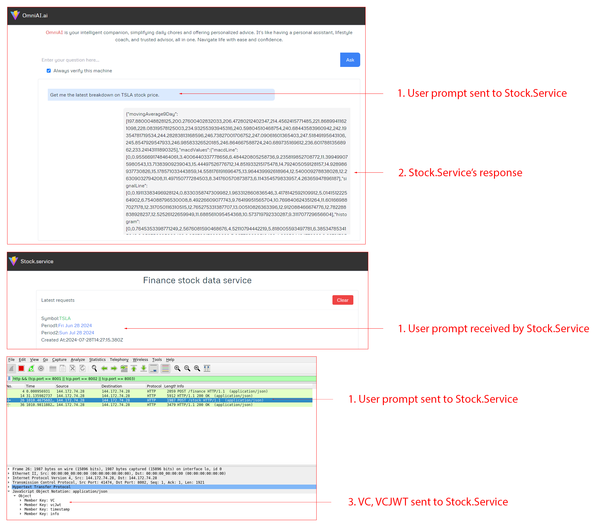

# OmniAI and Stock Service Communication

OmniAI when prompted with a text that contains the **keyword "latest"** and a **ticker symbol** **among "TSLA", "AAPL", "GOOGL", "AMZN", "MSFT", and "NFLX"** will fetch the last 30-day stock data and their corresponding technical indicators from Stock Service data provider. This bidirectional communication between machines requires valid VC JWT for both parties to be successful.

* OmniAI URL: [http://172.86.114.187:8001/](http://172.86.114.187:8001/)  
* Stock Service URL: [http://172.86.114.187:8002/](http://172.86.114.187:8002/)  
* Wireshark URL for visualizing HTTP communication between machines: [http://172.86.114.187:14500/?floating\_menu=false\&password=wireshark\&sharing=true](http://172.86.114.187:14500/?floating_menu=false&password=wireshark&sharing=true)  
  * Select `Loopback: lo` interface.  
  * Fill `http && (tcp.port == 8001 || tcp.port == 8002)` in the filter box to visualize communication between OmniAI and Stock Service only.

[Back to Index](../index.md) | [Previous: OmniAI and WealthWhisperer Communication](./omniAI_wealthWhisperer_communication.md)
