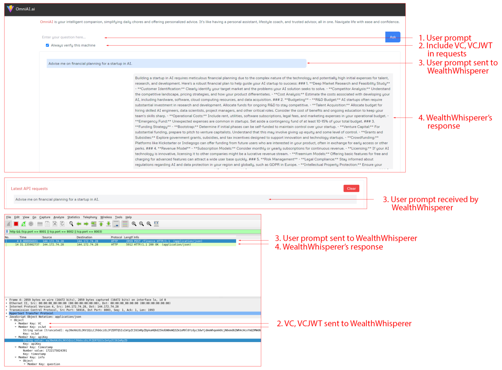

# OmniAI and WealthWhisperer Communication

OmniAI when prompted with a text that contains the **keyword "finance"/"financial"/"business"** will forward the request to WealthWhisperer. This bidirectional communication between AI services requires valid VC JWT for both parties to be successful.

**Important Notice:** As of December 2024, our beta repositories and corresponding demos are no longer functioning. This is due to TBD discontinuing operations and shutting down their gateway node on the DHT network. For more information, see [TechCrunch's article on Block scaling back investments](https://techcrunch.com/2024/11/07/block-scales-back-tidal-investment-and-shutters-tbd-in-favor-of-bitcoin-mining/).

<!-- * OmniAI URL: [http://172.86.114.187:8001/](http://172.86.114.187:8001/)   -->
<!-- * WealthWhisperer URL: [http://172.86.114.187:8003/](http://172.86.114.187:8003/)   -->
<!-- * Wireshark URL for visualizing HTTP communication between machines: [http://172.86.114.187:14500/?floating\_menu=false\&password=wireshark\&sharing=true\&keyboard=false](http://172.86.114.187:14500/?floating_menu=false&password=wireshark&sharing=true&keyboard=false)   
  * Select `Loopback: lo` interface.  
  * Fill `http && (tcp.port == 8001 || tcp.port == 8003)` in the filter box to visualize communication between OmniAI and WealthWhisperer only. -->

[Back to Index](../index.md) | [Previous: Registry Search](./registry_search.md) | [Next: OmniAI-Stock Service Communication](./omniAI_stockService_communication.md)
