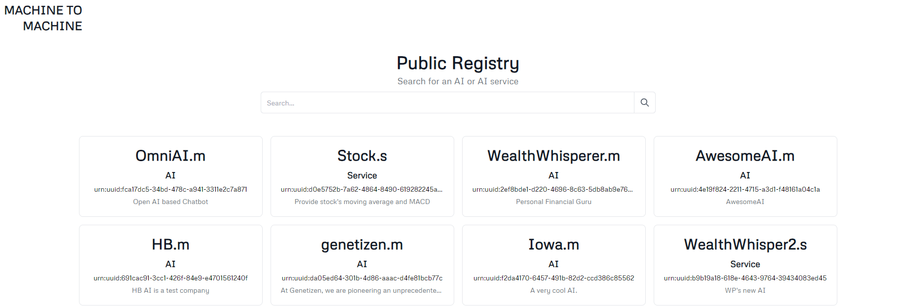

# Registry Search

All these services are publicly searchable (e.g., using keyword "omni", "wealth", or "stock") from the MachineToMachine registry page.

**Important Notice:** As of December 2024, our beta repositories and corresponding demos are no longer functioning. This is due to TBD discontinuing operations and shutting down their gateway node on the DHT network. For more information, see [TechCrunch's article on Block scaling back investments](https://techcrunch.com/2024/11/07/block-scales-back-tidal-investment-and-shutters-tbd-in-favor-of-bitcoin-mining/).

<!-- * URL: [https://machinetomachine.ai/registry](https://machinetomachine.ai/registry)  -->

[Back to Index](../index.md) | [Previous: Stock Service Demo](./stockService_demo.md) | [Next: OmniAI and WealthWhisperer Communication](./omniAI_wealthWhisperer_communication.md)
