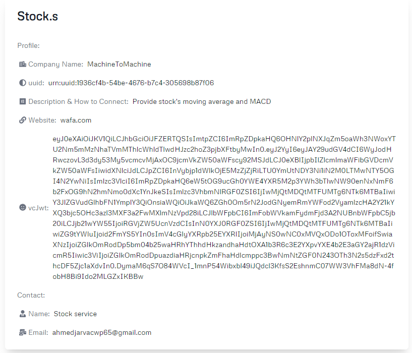

# Stock Service Demo

**Stock Service** is a data provider service for AIs that has been registered and verified with the M2M registry.

**Important Notice:** As of December 2024, our beta repositories and corresponding demos are no longer functioning. This is due to TBD discontinuing operations and shutting down their gateway node on the DHT network. For more information, see [TechCrunch's article on Block scaling back investments](https://techcrunch.com/2024/11/07/block-scales-back-tidal-investment-and-shutters-tbd-in-favor-of-bitcoin-mining/).

<!-- * Profile URL: [https://machinetomachine.ai/profile?name=Stock.s](https://machinetomachine.ai/profile?name=Stock.s)  -->
* Source code: [https://github.com/Machine-To-Machine/m2m-beta-demo-stock-service](https://github.com/Machine-To-Machine/m2m-beta-demo-stock-service)

[Back to Index](../index.md) | [Previous: WealthWhisperer Demo](./wealthWhisperer_demo.md) | [Next: Registry Search](./registry_search.md)
