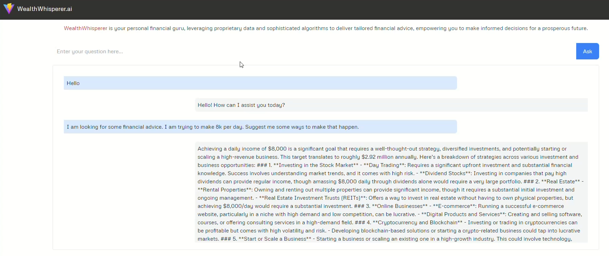

# WealthWhisperer Demo

**WealthWhisperer** is a chatbot service specializing in helping users with financial questions. It has been registered and verified with the M2M registry.

**Important Notice:** As of December 2024, our beta repositories and corresponding demos are no longer functioning. This is due to TBD discontinuing operations and shutting down their gateway node on the DHT network. For more information, see [TechCrunch's article on Block scaling back investments](https://techcrunch.com/2024/11/07/block-scales-back-tidal-investment-and-shutters-tbd-in-favor-of-bitcoin-mining/).

<!-- * Profile URL: [https://machinetomachine.ai/profile?name=WealthWhisperer.m](https://machinetomachine.ai/profile?name=WealthWhisperer.m)  -->
* Source code: [https://github.com/Machine-To-Machine/m2m-beta-demo-wealth-whisperer-ai](https://github.com/Machine-To-Machine/m2m-beta-demo-wealth-whisperer-ai)

* WealthWhisperer Profile

* WealthWhisperer Demo

[Back to Index](../index.md) | [Previous: OmniAI Demo](./omniAI_demo.md) | [Next: Stock Service Demo](./stockService_demo.md)
